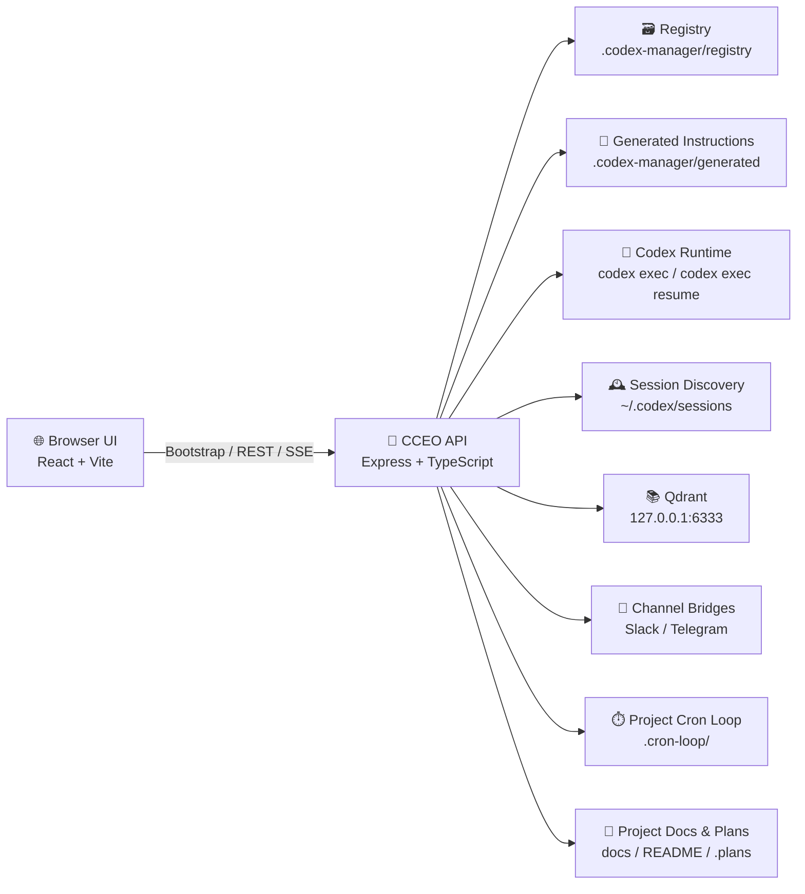

# CCEO 👔🤖

> **中文**：CCEO（Codex Executive Officer）是一个面向本机 Codex 生态的统一治理台，把角色、项目、会话、知识库、渠道桥接和 `.cron-loop` 自管理任务拉回同一张浏览器操作桌面。  
> **English**: CCEO (Codex Executive Officer) is a local-first control tower for the Codex ecosystem, bringing personas, projects, sessions, knowledge bases, channel bridges, and `.cron-loop` automation into one browser-native operating desk.


## ✨ Overview | 项目概览

CCEO 不是另一个“聊天壳”。它的目标是让你能在一个统一界面里同时看清和操作下面几类真实对象：

CCEO is not another chat wrapper. Its job is to let you inspect and operate the real moving parts of a local Codex setup from one unified interface:

- 🧠 **Personas / 角色人格**: 模型、推理力度、verbosity、system prompt、developer instructions、skills、MCP、tools、渠道身份。
- 📁 **Projects / 项目治理**: 项目路径、经理角色、参与角色、知识库权限、渠道绑定。
- 🕰️ **Sessions / 历史会话**: 复用 `~/.codex/sessions` 与 archived sessions，并把历史上下文重新挂接到项目和角色。
- 📚 **Knowledge Bases / 知识库**: 管理本机 Qdrant collection，声明项目可读和可写边界。
- 💬 **Channels / 渠道桥接**: 管理 Slack 与 Telegram 接入、配置校验、真实投递测试和运行态。
- ⏱️ **Cron Loop / 自管理循环**: 扫描和操控项目内 `.cron-loop/` singleton loop。
- 🧑‍💼 **Executive Runs / 总经理运行**: 用真实 `codex exec` / `codex exec resume` 推进任务，并在 UI 中看到事件时间线。

> [!TIP]
> **中文**：CCEO 的原则不是“保存了就算完成”，而是“必须能验证运行态、时间戳、输出摘要或外部消息结果”。  
> **English**: CCEO treats “saved” as insufficient. A workflow is only done when runtime state, timestamps, summaries, or external delivery results prove it.

## 🌟 Highlights | 核心亮点

- 🚀 **Local-first by design / 本机优先设计**  
  所有核心能力围绕你本机已有的 Codex、会话、项目目录和工具链展开，而不是依赖一个抽象云端控制平面。  
  Core workflows are built around your local Codex install, sessions, project roots, and toolchain instead of a detached cloud dashboard.

- 🧩 **One desk, many control surfaces / 一张桌面，多种控制面**  
  你可以在同一个前端里切换总览、总经理、角色、会话、知识库、项目、Cron、渠道 8 个工作面。  
  You get eight coordinated workspaces in one frontend: Overview, Manager, Personas, Sessions, Knowledge Bases, Projects, Cron, and Channels.

- 🔌 **Real bridge, not mock theater / 真实桥接，不是演示假象**  
  Slack 支持 `socket / webhook / http` 配置模型、校验、dry-run、真实投递测试，以及 socket connect/disconnect。  
  Slack includes `socket / webhook / http` configuration models, validation, dry-run, real delivery tests, and socket connect/disconnect.

- 🧭 **Human-readable guidance / 对人类友好的说明层**  
  前端内置说明层、当前上下文卡、动态下一步建议和复杂页面工作流提示，避免用户在字段海里迷路。  
  The UI includes guidance layers, current-context cards, dynamic next-step suggestions, and workflow help for complex pages.

- 🔁 **Self-iteration built in / 自我迭代内建**  
  项目自身已经接入 `.cron-loop/` singleton loop，用于持续审计、记录和推进改进。  
  The project ships with its own `.cron-loop/` singleton loop for ongoing audit, documentation, and iteration.

## 🧰 What You Can Do | 你可以做什么

| Workspace | 中文 | English |
| --- | --- | --- |
| 🏠 Overview | 快速检查 Codex CLI、Qdrant、MCP、项目、知识库、渠道、Cron 的总体健康状态。 | Check the high-level health of Codex CLI, Qdrant, MCP, projects, knowledge bases, channels, and cron workflows. |
| 🧑‍💼 Manager | 给总经理发送真实任务，选择角色、项目、旧 session，并查看运行事件时间线。 | Send real prompts to the executive manager, choose persona/project/session context, and inspect the run event timeline. |
| 🎭 Personas | 配置人格、模型、推理强度、verbosity、指令、skills、MCP、tools 与渠道身份。 | Configure persona tone, model, reasoning level, verbosity, instructions, skills, MCP servers, tools, and channel identity. |
| 🗂️ Sessions | 扫描活动与归档会话，并把旧会话重新挂接到项目和角色。 | Scan active and archived sessions, then relink them to projects and personas. |
| 📚 Knowledge Bases | 管理 Qdrant 地址、collection、只读状态，并让项目声明可读/可写权限。 | Manage Qdrant URLs, collections, read-only state, and project-level read/write permissions. |
| 🏗️ Projects | 定义治理边界，绑定经理角色、参与角色、知识库和渠道目标。 | Define governance boundaries by assigning manager personas, participant personas, knowledge bases, and channel bindings. |
| ⏱️ Cron | 扫描项目内 `.cron-loop/`，执行 `validate / stop / start / paths / destroy`。 | Inspect project `.cron-loop/` jobs and execute `validate / stop / start / paths / destroy`. |
| 💬 Channels | 配置 Slack/Telegram 渠道、校验参数、做 dry-run/live test，并观察最近运行态。 | Configure Slack/Telegram channels, validate parameters, run dry-run/live tests, and inspect recent runtime status. |

## 🗺️ Core Capabilities | 当前功能地图

### 1. Executive Runtime | 总经理运行

- 使用真实 `codex exec` 与 `codex exec resume`。  
  Uses real `codex exec` and `codex exec resume`.
- 支持把角色、项目和旧 session 上下文拼装到同一次运行中。  
  Supports composing persona, project, and prior session context into one run.
- 提供事件流与最终消息持久化。  
  Persists run events and final messages.

### 2. Governance Registry | 治理注册表

- 运行数据保存在 `.codex-manager/registry/`。  
  Runtime data is stored in `.codex-manager/registry/`.
- 角色、项目、知识库、渠道、会话挂接和经理线程都可持久化。  
  Personas, projects, knowledge bases, channels, session links, and manager threads are persisted.
- 角色物化后的指令文件会写入 `.codex-manager/generated/`。  
  Materialized persona instruction files are written into `.codex-manager/generated/`.

### 3. Channel Bridges | 渠道桥接

- Slack 已落地：
  - `socket / webhook / http` 配置模型
  - 配置校验
  - dry-run / live 测试
  - socket connect / disconnect
  - 运行态持久化
  - 入站路由基础与 thread 回复链路
- Slack currently includes:
  - `socket / webhook / http` configuration modes
  - validation
  - dry-run / live delivery tests
  - socket connect / disconnect
  - runtime persistence
  - inbound routing foundations with threaded replies

- Telegram 已落地：
  - token / chat id / base url 配置
  - 配置校验
  - dry-run / live 测试
- Telegram currently includes:
  - token / chat id / base URL configuration
  - validation
  - dry-run / live delivery tests

### 4. Knowledge & Session Awareness | 知识和会话感知

- 会话索引读取 `~/.codex/sessions` 和 archived sessions。  
  Session discovery reads `~/.codex/sessions` and archived sessions.
- Qdrant 状态检查默认读取 `http://127.0.0.1:6333`。  
  Qdrant health checks default to `http://127.0.0.1:6333`.
- 项目可以声明哪些 collection 只读、哪些可写。  
  Projects can declare which collections are read-only and which are writable.

### 5. Project Singleton Cron Loop | 项目级单例 Cron Loop

- 每个项目当前按 singleton loop 管理。  
  Each project currently follows a singleton loop model.
- CCEO 自身已经带有 `.cron-loop/` 目录与管理脚本。  
  CCEO itself already includes a `.cron-loop/` directory and management scripts.
- 默认计划是 `17 */4 * * *`，默认超时是 `12600` 秒。  
  The default schedule is `17 */4 * * *` with a default timeout of `12600` seconds.

## 🚀 Quick Start | 快速开始

### Prerequisites | 前置条件

- 🟢 `Node.js` 和 `npm` 可用。  
  `Node.js` and `npm` are available.
- 🟢 本机已安装并可使用 `codex` CLI。  
  A local `codex` CLI is installed and usable.
- 🟡 如果你要使用知识库面板，建议本机已有 Qdrant，默认地址为 `http://127.0.0.1:6333`。  
  If you want the knowledge-base panel to be useful, run Qdrant locally at `http://127.0.0.1:6333` or update the target URL.
- 🟡 如果你要使用 Slack 或 Telegram，请准备对应 token。  
  If you want Slack or Telegram bridging, prepare the necessary credentials.

### Install & Run | 安装与运行

```bash
npm install
npm run dev
```

开发模式会同时启动：

The development workflow starts both services:

- 🌐 Frontend (Vite): `http://127.0.0.1:5173`
- 🔌 API Server (Express): `http://127.0.0.1:3187`

生产构建：

Production build:

```bash
npm run build
npm start
```

生产模式下，Express 会从 `dist/client` 提供前端静态资源。

In production mode, Express serves the frontend from `dist/client`.

### Default Ports | 默认端口

| Service | Port / URL | Notes |
| --- | --- | --- |
| CCEO API | `http://127.0.0.1:3187` | 默认服务端入口，也是生产环境主入口。 / Default backend entry and production host. |
| Vite Dev | `http://127.0.0.1:5173` | 开发模式下的前端页面。 / Frontend dev server. |
| Qdrant | `http://127.0.0.1:6333` | 默认知识库状态探测目标。 / Default knowledge-base probe target. |

## 🧭 Recommended First-Run Workflow | 推荐首次使用流程

### Step 1. Open Overview | 先看总览页

- 中文：先确认 Codex CLI、Qdrant、MCP、项目、知识库、渠道状态是不是基本健康。  
- English: Start on Overview and verify that Codex CLI, Qdrant, MCP, projects, knowledge bases, and channels are at least minimally healthy.

### Step 2. Create or refine personas | 建立或修正角色

- 中文：先定义好总经理和项目角色的模型、指令、skills、MCP、tools 和渠道话术。  
- English: Define manager and project personas first, including models, instructions, skills, MCP servers, tools, and channel identity.

### Step 3. Register projects and knowledge bases | 注册项目与知识库

- 中文：把真实项目路径、经理角色、参与角色、知识库权限和渠道绑定配齐。  
- English: Wire in real project paths, manager personas, participant personas, knowledge-base permissions, and channel bindings.

### Step 4. Link useful sessions | 挂接旧会话

- 中文：如果已有可复用上下文，就在会话页把历史 session 挂到对应项目和角色。  
- English: If previous work should be resumed, link the relevant sessions to the correct project and persona.

### Step 5. Run the manager | 使用总经理推进任务

- 中文：到“总经理”页发送一个明确、有验收条件的 prompt，并观察运行事件时间线。  
- English: Go to the Manager workspace, send a precise prompt with acceptance criteria, and watch the run event timeline.

### Step 6. Connect channels | 接入外部渠道

- 中文：在“渠道”页保存配置后，按 `validate → dry-run → live test → connect` 的顺序走。  
- English: In Channels, follow `validate → dry-run → live test → connect` after saving configuration.

### Step 7. Validate cron automation | 验证 cron 自动化

- 中文：在“Cron”页先跑 `validate`，再决定要不要 `start / stop / paths / destroy`。  
- English: In the Cron workspace, start with `validate`, then decide whether `start / stop / paths / destroy` is needed.

> [!IMPORTANT]
> **中文**：不要把“保存成功”当成结束。请以运行态、最近时间戳、`latest.md`、Slack/Telegram 实际回包为准。  
> **English**: Do not treat “saved successfully” as done. Use runtime state, recent timestamps, `latest.md`, and actual Slack/Telegram replies as your completion signals.

## 💬 Slack & Channel Usage | Slack 与渠道使用说明

### Slack Socket Mode | Slack Socket 模式

推荐优先使用 Slack `socket mode`，因为它更适合本机开发与常驻桥接：

Slack `socket mode` is the recommended path for local development and persistent bridging:

1. 在渠道页选择 `Slack Bridge`。  
   Pick `Slack Bridge` in the Channels workspace.
2. 将 `Slack Mode` 设为 `socket`。  
   Set `Slack Mode` to `socket`.
3. 填入 `xoxb-...` Bot Token 和 `xapp-...` App Token。  
   Provide the `xoxb-...` Bot Token and `xapp-...` App Token.
4. 保存后执行 `校验配置 / Validate`。  
   Save, then run `Validate`.
5. 再执行 `Dry Run` 与 `真实发送测试 / Live Test`。  
   Run `Dry Run` and `Live Test`.
6. 最后执行 `Connect Slack`。  
   Finally, execute `Connect Slack`.

当前实践建议：

Current operational advice:

- 🧷 一 bot 一 app，不要复用旧 Slack App。  
  Use one bot per Slack app; do not reuse old apps.
- 📣 如果 `slackRequireMention` 为 `true`，频道中需要 `@CCEO` 才会触发。  
  If `slackRequireMention` is `true`, channel messages must mention `@CCEO`.
- 🧵 频道回复默认走 thread。  
  Channel replies are threaded by default.
- 🔍 做验证时要区分真实 API `3187` 和 review/mock `3197`。  
  Distinguish the real API on `3187` from the review/mock server on `3197`.

详细接入指南请看：

For the detailed operational guide, see:

- [`CCEO_to_Slack_GUIDE.md`](./CCEO_to_Slack_GUIDE.md)

## 🏛️ Architecture | 项目架构

### System View | 系统视图



### Layer by Layer | 分层说明

#### 1. Frontend Layer | 前端层

- 文件位置：`src/App.tsx`、`src/app-support.tsx`、`src/api.ts`、`src/styles.css`  
  Files: `src/App.tsx`, `src/app-support.tsx`, `src/api.ts`, `src/styles.css`
- 责任：
  - 呈现 8 个工作面
  - 显示操作说明层、结果摘要和上下文提示
  - 调用后端 REST API
  - 订阅运行事件流
- Responsibilities:
  - render the eight workspaces
  - show guidance layers, summaries, and contextual hints
  - call the backend REST API
  - subscribe to run event streams

#### 2. API Layer | 接口层

- 文件位置：`server/index.ts`  
  File: `server/index.ts`
- 责任：
  - 提供 `/api/bootstrap`
  - 提供角色、项目、知识库、渠道、会话挂接的 CRUD API
  - 提供总经理运行入口 `/api/manager/chat`
  - 提供运行事件流 `/api/runs/:runId/events`
  - 提供 cron 与渠道动作接口
- Responsibilities:
  - serve `/api/bootstrap`
  - expose CRUD endpoints for personas, projects, knowledge bases, channels, and session links
  - expose the manager entry at `/api/manager/chat`
  - stream run events through `/api/runs/:runId/events`
  - expose cron and channel action endpoints

#### 3. Domain Services | 领域服务层

- `server/lib/codex.ts`
  - 把角色/项目配置翻译成真实 Codex 运行参数，并记录运行事件。  
    Translates persona/project configuration into real Codex runtime arguments and records run events.
- `server/lib/manager.ts`
  - 将用户 prompt 写入线程，启动运行，并在结束后持久化最终回复。  
    Writes prompts to manager threads, starts runs, and persists final messages.
- `server/lib/registry.ts`
  - 维护人物、项目、知识库、渠道、线程和会话挂接的注册表。  
    Maintains the registry for personas, projects, knowledge bases, channels, threads, and session links.
- `server/lib/slack-bridge.ts`
  - 管理 Slack socket 生命周期、消息入站路由和线程回复。  
    Manages Slack socket lifecycle, inbound routing, and threaded replies.
- `server/lib/channels.ts`
  - 负责渠道配置校验、dry-run/live 请求构造和投递。  
    Handles validation, dry-run/live request construction, and delivery.
- `server/lib/cron-loop.ts`
  - 扫描项目 `.cron-loop/` 并调用 canonical `manage_cron.mjs`。  
    Scans project `.cron-loop/` state and invokes the canonical `manage_cron.mjs`.
- `server/lib/discovery.ts`
  - 探测本机 Codex 环境、技能和 MCP。  
    Discovers the local Codex environment, skills, and MCP servers.
- `server/lib/sessions.ts`
  - 发现和摘要化本地 sessions。  
    Discovers and summarizes local sessions.
- `server/lib/qdrant.ts`
  - 检查 Qdrant reachability 和 collections。  
    Checks Qdrant reachability and collections.

### Runtime Flow | 运行流

1. 浏览器打开页面时，前端优先读取服务端内联的 bootstrap 数据，必要时再走 `/api/bootstrap`。  
   When the browser loads, the frontend first tries to use the server-inlined bootstrap payload and falls back to `/api/bootstrap` when needed.
2. 用户在 UI 中修改角色、项目、知识库、渠道时，数据会写入 `.codex-manager/registry/*.json`。  
   When the user edits personas, projects, knowledge bases, or channels, data is persisted into `.codex-manager/registry/*.json`.
3. 当用户从“总经理”页发起任务时，后端会写入线程、启动真实 Codex run，并通过 SSE 向前端推送事件。  
   When a task is sent from Manager, the backend writes a thread message, starts a real Codex run, and pushes run events back over SSE.
4. 当 Slack 入站消息命中桥接规则时，Slack bridge 会解析消息、解析项目与角色归属、调用总经理链路并回帖。  
   When Slack inbound traffic matches bridge rules, the Slack bridge resolves routing, dispatches the manager pipeline, and posts a threaded reply.
5. 当用户操作 Cron 页时，服务端会扫描 `.cron-loop/` 平铺文件并调用标准管理脚本。  
   When the Cron workspace is used, the server scans flat `.cron-loop/` files and invokes the standard management script.

## 🧱 Tech Stack | 技术栈

| Layer | Stack | Notes |
| --- | --- | --- |
| Frontend | React 19 + Vite 7 + CSS | 单页治理台，强调说明层与操作引导。 / Single-page control desk with guidance-heavy UX. |
| Backend | Express 5 + TypeScript | 提供 bootstrap、CRUD、运行控制、cron 和渠道 API。 / Serves bootstrap, CRUD, run control, cron, and channel APIs. |
| Runtime Control | Codex CLI | 通过 `codex exec` 和 `codex exec resume` 驱动真实执行。 / Powers real execution through `codex exec` and `codex exec resume`. |
| Validation / Models | Zod + shared TypeScript models | 共享对象模型，减少前后端漂移。 / Shared object models reduce frontend/backend drift. |
| Channels | Slack Bolt + direct HTTP delivery | 处理 Slack socket 连接与消息投递。 / Handles Slack sockets and channel delivery. |
| Storage | JSON files + generated instruction files | 数据落在本地，便于审计和恢复。 / Local persistence keeps the system inspectable and recoverable. |
| Knowledge | Qdrant | 当前用于状态探测与 collection 视图。 / Currently used for status checks and collection visibility. |
| Automation | `.cron-loop/` + project scripts | 支持自管理循环、前端审计和巡检。 / Supports self-iteration, frontend audits, and review loops. |

## 📂 Directory Layout | 目录结构

```text
CCEO/
├── src/                      # React frontend / 前端界面
├── server/                   # Express API and service layer / 服务端与桥接逻辑
├── shared/                   # Shared TypeScript models / 前后端共享模型
├── docs/                     # Operator manuals and inventories / 操作手册与功能清单
├── scripts/                  # Review, audit, and helper scripts / 审计与辅助脚本
├── .codex-manager/           # Runtime registry and generated instructions / 运行注册表与生成指令
├── .cron-loop/               # Project singleton cron-loop / 项目级单例循环
├── output/playwright/        # Playwright-related exported artifacts / Playwright 产物
├── .plans/                   # Planning and iteration notes / 计划与迭代记录
└── README.md                 # This document / 当前说明文档
```

### Important Runtime Data | 重要运行数据

- `.codex-manager/registry/`
  - `personas.json`
  - `projects.json`
  - `knowledge-bases.json`
  - `channels.json`
  - `manager-threads.json`
  - `session-links.json`
- `.codex-manager/generated/`
  - 角色物化指令文件  
    Materialized persona instruction files
- `.cron-loop/`
  - `prompt.md`
  - `runner.sh`
  - `latest.md`
  - `ledger.md`
  - `state.json`
  - `issues.registry.json`
  - `issues.events.jsonl`
  - `issues.summary.md`
  - `issues.rules.json`
  - `manage.mjs`

## 📘 Documentation | 文档索引

- [`docs/Feature-Inventory.md`](./docs/Feature-Inventory.md)  
  中文功能清单、对象模型、实现状态、已知边界。  
  Chinese inventory of features, object models, implementation status, and current boundaries.

- [`docs/Frontend-Operator-Manual.md`](./docs/Frontend-Operator-Manual.md)  
  前端复杂功能的逐步操作手册与判定标准。  
  Step-by-step operator manual and completion criteria for complex frontend workflows.

- [`CCEO_to_Slack_GUIDE.md`](./CCEO_to_Slack_GUIDE.md)  
  从浏览器已登录 Slack 到成功接入独立 bot 的实战指南。  
  Practical guide from an already logged-in Slack browser session to a successfully connected standalone bot.

## 🧪 Current Boundaries | 当前边界与未完成项

- ⚠️ Qdrant 目前偏向状态检查和 collection 视图，还没有完整文档入库编排。  
  Qdrant is currently focused on status checks and collection visibility; full ingestion orchestration is not yet implemented.
- ⚠️ Telegram 目前以配置、校验和投递测试为主，回流路由还需继续强化。  
  Telegram currently emphasizes configuration, validation, and delivery tests; inbound routing still needs more work.
- ⚠️ Slack 桥接已经具备真实联通基础，但生产级提及策略、频道策略和更多安全约束还可以继续完善。  
  Slack bridging already works for real connectivity, but production-grade mention policies, channel policies, and tighter safety constraints can still be improved.
- ⚠️ 当前 cron 模型按项目 singleton loop 设计，不是多 job 编排平台。  
  The current cron model is intentionally project-singleton oriented rather than a multi-job orchestration platform.

## ❤️ Design Principles | 设计原则

- 先让人类看懂，再让系统更强。  
  Human clarity first, then more power.
- 先验证真实运行态，再相信 UI。  
  Trust verified runtime state before trusting the UI.
- 先把治理边界做清楚，再堆更多自动化。  
  Define governance boundaries before piling on automation.
- 一 bot 一 app，一项目一条 cron-loop。  
  One bot per app, one project per cron-loop.

## 📎 Useful Commands | 常用命令

```bash
# development / 开发
npm install
npm run dev

# production build / 生产构建
npm run build
npm start

# project cron-loop / 项目自管理循环
node .cron-loop/manage.mjs list
node .cron-loop/manage.mjs validate
node .cron-loop/manage.mjs stop
node .cron-loop/manage.mjs start
```

---

**中文**：如果你想把本机 Codex 从“分散的命令、会话和脚本”提升到“可治理、可验证、可桥接”的系统级桌面，CCEO 就是那层统一控制面。  
**English**: If you want to elevate local Codex from scattered commands, sessions, and scripts into a governable, verifiable, bridgeable operating system desk, CCEO is that control plane.
